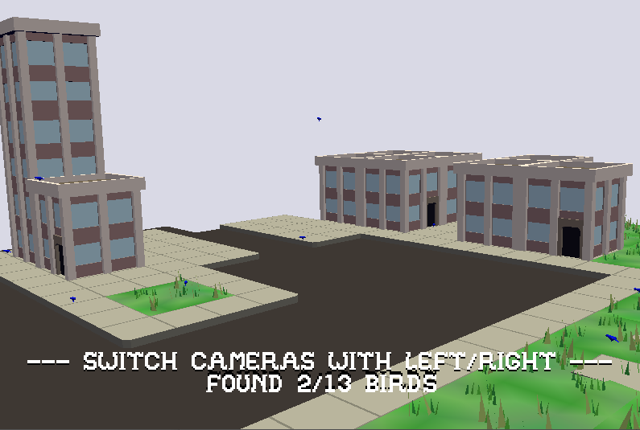

# Birbwatch

Author: Margot Stewart (erstewar)

Design: It's lowkey just the example game except I put birds in it?  Click on all the birds to "win"!

Screen Shot:

How To Play:

Switch between the cameras using the left and right arrow keys and click on birds to make them fly away!  Oh no!  Where did they go??

Drive them all away because birds aren't real.

Sources:

I reused the cityscape and sound from the original game.  The bird model was my own.
Heavily referenced http://antongerdelan.net/opengl/raycasting.html to remind me how the heck to raycast without Unity's helpful APIs.

This game was built with [NEST](NEST.md).
